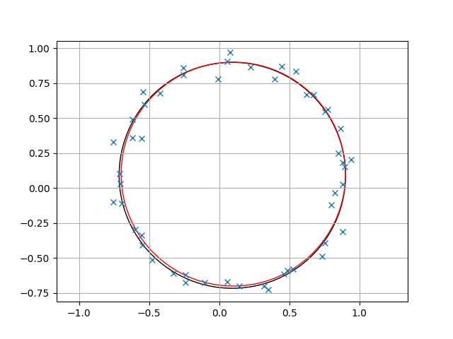

# A minimalist Gauss Newton Solver in Python

This is a very minimalist, yet functional, [Gauss-Newton](https://en.wikipedia.org/wiki/Gauss%E2%80%93Newton_algorithm#) solver in Python. This might be interesting if you want to understand the algorithm properly.

## Gauss Newton Problems

Assuming that you have a list of `m` 2D points and that you want to fit a model of parameters $x \in R ^ n$ such that the following cost is minimized: 

$$
\text{cost}(x) = \sum_{i=0}^{m} (r_i(x) ^ 2)
$$

Where $r_i$ is the residuals of the i-th point, with the current model `x`.

The [Gauss-Newton](https://en.wikipedia.org/wiki/Gauss%E2%80%93Newton_algorithm#) solver will iteratively solve this problem and find a solution `x`, using a gradient descent.

## How does the code work ?

It is very easy to re-use this code for fitting your own model. The file `gauss_newton.py` has two classes:
- The `GaussNewtonSolver`, which is the solver itself. You won't have to change this class, unless if you want to make it fancier.
- An **abstract class** `GenericFunctor`, that must be overriden and that contains an interface for the solver to work with. 

For fitting your own model, just write a subclass of `GenericFunctor` that overrides the three functions:
- `residuals`: computes the residulas
- `jacobians`: computes the jacobians
- `initial_condition`: computes the initial guess of the solver

## Circle Fitting with Gauss-Newton

I provided an example with a **circle fitting** problem: to fit a circle ($c_x, c_y, r$) over a set of 2D points. This example is in the file `circle_fit.py`, the subclass of `GenericFunctor` is called `CircleFunctor`. You can run this example with.

```bash
python circle_fit.py
```

Here is the results. In simply 3 iterations, the initial fitted circle in black estimates very quickly the real circle, in red.



You can see in the `circle_fit.py` how easy it is to run your code once you have your own functor: 

```python
data = generate_circle_data(...);
circle_model = CircleFunctor(3, data.shape[0])
solver = GaussNewtonSolver(circle_model)
result = solver.solve(data)
```

### Dependencies

Only two dependencies: `numpy` and `matplotlib`.
